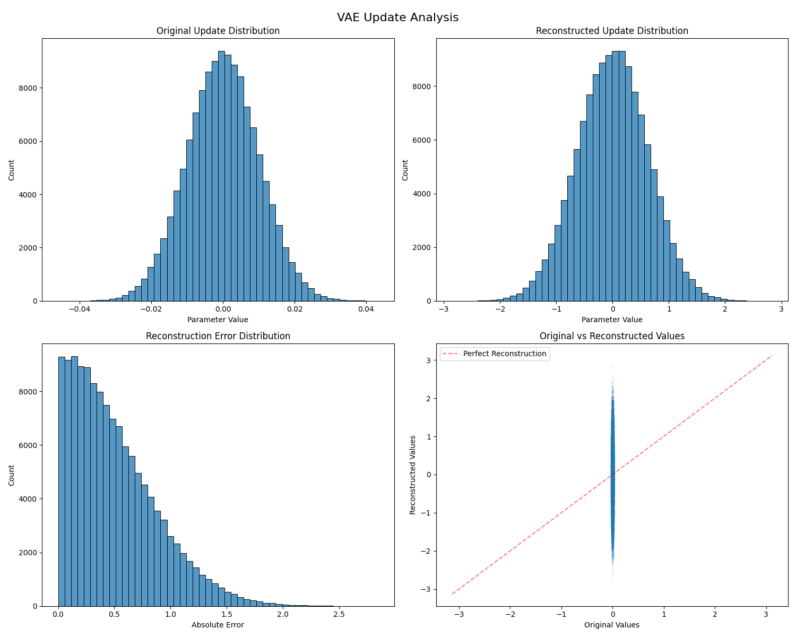

# Learning to Trust: Hypothesis Testing for Poison-Resilient Federated Learning

This repository implements a hypothesis testing-based defense mechanism for federated learning systems using variational autoencoders (VAE) to detect poisoning attacks. The framework learns the distribution of benign client updates and applies statistical hypothesis testing to identify potentially malicious updates with guaranteed error bounds.

## Key Features

- VAE-based modeling of benign update distributions
- Probabilistic defense with statistical guarantees on error rates
- Support for heterogeneous (non-IID) client updates
- Handling of partially malicious clients
- Rigorous evaluation framework

## Project Structure

```
├── data/                   # Dataset storage
│   └── updates/           # Stored model updates for testing
├── src/
│   ├── clients/           # Client implementation
│   │   └── __init__.py
│   ├── defense/           # Defense mechanism
│   │   └── probabilistic_defense.py
│   ├── fl_system/         # Core FL system
│   │   └── __init__.py
│   ├── models/            # Neural network models
│   │   └── vae.py
│   └── utils/             # Helper utilities
│       ├── generate_updates.py
│       └── visualize.py
├── tests/                 # Test suite
│   ├── figures/           # Visualization outputs
│   ├── test_vae_defense.py
│   └── test_vae.py
├── README.md             # Project documentation
├
└── requirements.txt      # Project dependencies
```

## Installation

```bash
# Create and activate virtual environment
python -m venv venv
source venv/bin/activate

# Install dependencies
pip install -r requirements.txt
```

## Usage

### VAE Update Analysis

<p align="center">
  
  <br>
  <em>Figure 1: Visualization of VAE reconstruction performance on model updates</em>
</p>
The visualization shows how our VAE defense mechanism analyzes model updates:

1. **Original vs Reconstructed Distribution** (top row):
   - Left: Distribution of original weight updates shows a normal distribution centered around 0
   - Right: VAE reconstruction closely preserves the overall distribution shape, indicating good learning of benign update patterns

2. **Error Analysis** (bottom row):
   - Left: Reconstruction error distribution shows most errors are small (concentrated near 0)
   - Right: Scatter plot compares original vs reconstructed values, with points clustering around the perfect reconstruction line (red dashed)

This analysis helps identify malicious updates by detecting those that deviate significantly from the learned benign distribution patterns.


## Contributors

- **Seyyidahmed Lahmar** - *Initial work* 
- **Abdelhamid Haouaht** - *Initial work*
- **                  ** - *            *

## License

This project is licensed under the MIT License - see the [LICENSE](LICENSE) file for details.